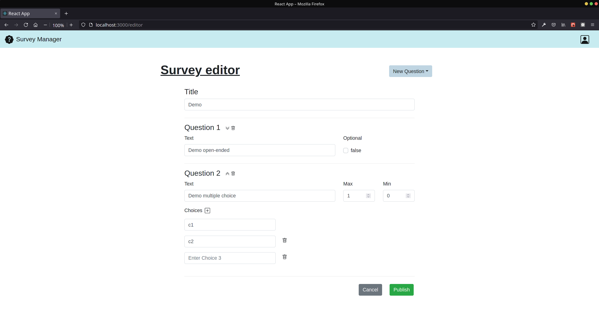

# Exam #1: "Questionario"

## Student: s290270 Belluardo Gabriele

## React Client Application Routes

<!--
- Route `/`: page content and purpose
- Route `/something/:param`: page content and purpose, param specification
- ...
-->

- Route `/`: `Dashboard` that shows avaible surveys ready for compilation; if logged as admin, it shows published surveys and number of compilation for each one
- Route `/editor`: `Editor` for surveys creation, this is avaible only for authenticated admins
- Route `/login`: `Login` shows the login form
- Route `/surveys`: `Surveys` shows forms for surveys compliation, this is avaible all users without authentication; if logged as admin shows the replies for selected survey

## API Server

<!--
- POST `/api/login`
  - request parameters and request body content
  - response body content
- GET `/api/something`
  - request parameters
  - response body content
- POST `/api/something`
  - request parameters and request body content
  - response body content
- ...
-->

- POST `/api/sessions`

  - no request parameters
  - request body content:

    ```json
    {
      "username": String,
      "password": String
    }
    ```

    - response body content:

    if `HTTP/1.1 200 OK`:

    ```json
    {
      "id": Int,
      "email": String,
      "username": String
    }
    ```

    else if `HTTP/1.1 401 Unauthorized`:

    ```json
    {
      "message": "Incorrect username or password."
    }
    ```

- DELETE `/api/sessions/current`

  - no request parameters or body content
  - no response body content

- GET `/api/sessions/current`

  - no request body content
  - response body content:

    if `HTTP/1.1 200 OK`:

    ```json
    {
      "id": Int,
      "email": String,
      "username": String
    }
    ```

    else if `HTTP/1.1 401 Unauthorized`:

    ```json
    {
      "error": "Unauthenticated user!"
    }
    ```

- GET `/api/surveys`

  - no request parameters or body content
  - response body content

    if `HTTP/1.1 200 OK`:

    ```json
    [
      {
        "id": Int,
        "adminStr": String,
        "title": String,
      },
      ...
    ]
    ```

    else if `HTTP/1.1 503 Service Unavailable`:

    ```json
    {
      "msg": "Database error during the retrive of surveys."
    }
    ```

- GET `/api/questions`

  - request parameters: `id` with validation as `Int`
  - no request body content
  - response body content:

    if `HTTP/1.1 200 OK`:

    ```json
    [
      {
        "question_id": Int,
        "text": String,
        "optional": Boolean,
        "min": Int,
        "max": Int,
        "choices": [String, String, ...]
      },
      ...
    ]
    ```

    else if `HTTP/1.1 503 Service Unavailable`:

    ```json
    {
      "msg": "Database error during the retrive of questions."
    }
    ```

    else if `HTTP/1.1 422 Unprocessable Entity`:

    ```json
    {
      "err": [
        {
          "value": "wrong-value",
          "msg": "Invalid value",
          "param": "id",
          "location": "params"
        }
      ]
    }
    ```

- GET `/api/admin/replies`

  - request parameters: `survey_id` with validation as `Int`
  - no request body content
  - response body content:

    if `HTTP/1.1 200 OK`:

    ```json
    [
      {
        "survey_id": Int,
        "question_id": Int,
        "text": String,
        "user": String,
        "choices": [Boolean, Boolean, ...]
      },
      ...
    ]
    ```

    else if `HTTP/1.1 503 Service Unavailable`:

    ```json
    {
      "msg": "Database error during the retrive of replies."
    }
    ```

    else if `HTTP/1.1 422 Unprocessable Entity`:

    ```json
    {
      "err": [
        {
          "value": "wrong-value",
          "msg": "Invalid value",
          "param": "survey_id",
          "location": "params"
        }
      ]
    }
    ```

    else if `HTTP/1.1 401 Unauthorized`:

    ```json
    {
      "error": "Unauthenticated user!"
    }
    ```

- POST `/api/replies`

  - no request parameters
  - request body content:

    ```json
    {
      "reply":[
        {
          "question_id": Int,
          "survey_id": Int,
          "user": String,
          "text": String || null,
          "choices": [String, String, ...] || null
        },
        ...
      ]
    }
    ```

  - response body content:

    if `HTTP/1.1 200 OK`: no body

    else if `HTTP/1.1 503 Service Unavailable`:

    ```json
    {
      "msg": "Database error during the creation of reply."
    }
    ```

    else if `HTTP/1.1 422 Unprocessable Entity`:

    ```json
    {
      "err": [
        {
          "value": "wrong-value",
          "msg": "Invalid value",
          "param": "param-field",
          "location": "params"
        }
      ]
      ...
    }
    ```

- GET `/api/admin/surveys`

  - no request parameters
  - no request body content

  - response body content:

    if `HTTP/1.1 200 OK`:

    ```json
    [
      {
        "id": Int,
        "admin": Int,
        "adminStr": String,
        "title": String,
        "replies": Int
      },
      ...
    ]
    ```

    else if `HTTP/1.1 503 Service Unavailable`:

    ```json
    {
      "msg": "Database error during the retrive of surveys."
    }
    ```

    else if `HTTP/1.1 401 Unauthorized`:

    ```json
    {
      "error": "Unauthenticated user!"
    }
    ```

- POST `/api/admin/surveys`

  - no request parameters
  - request body content:

    ```json
    {
      "title": String,
      "questions":[
        {
          "text": String,
          "optional": Boolean || null,
          "min": Int || null,
          "max": Int || null,
          "choices": [String, String, ...] || null
        },
        ...
      ]
    }
    ```

  - response body content:

    if `HTTP/1.1 200 OK`: no body

    else if `HTTP/1.1 503 Service Unavailable`:

    ```json
    {
      "error": "Database error during the creation of survey."
    }
    ```

    else if `HTTP/1.1 422 Unprocessable Entity`:

    ```json
    {
      "err": [
        {
          "value": "wrong-value",
          "msg": "Invalid value",
          "param": "param-field",
          "location": "params"
        }
      ]
      ...
    }
    ```

    else if `HTTP/1.1 401 Unauthorized`:

    ```json
    {
      "error": "Unauthenticated user!"
    }
    ```

## Database Tables

<!--
- Table `users` - contains xx yy zz
- Table `something` - contains ww qq ss
- ...
-->

- Table `users` - contains `id*` `email` `username` `hash`
- Table `surveys` - contains `id*` `admin` `adminStr` `title` `replies`
- Table `questions` - contains `question_id*` `survey_id` `text` `optional` `min` `max` `choice1` `choice2` ... `choice10`
- Table `replies` - contains `survey_id*` `question_id*` `user*` `text` `choice1` `choice2` ... `choice10`

_fields with `*` are the primary keys_

## Main React Components

<!--
- `ListOfSomething` (in `List.js`): component purpose and main functionality
- `GreatButton` (in `GreatButton.js`): component purpose and main functionality
- ...

(only _main_ components, minor ones may be skipped)
-->

- `Dashboard` (in `components/Dashboard.js`): shows a list of surveys (all avaible ones for common users, only own ones for admins); manages creation of new surveys and redirections for proper route (`/editor` for new survey creation, or `/survey` for survey compilation)
- `Editor` (in `components/Editor.js`): shows and validates forms for new survey creation; manages requested events such as creation/delete of new questions and position changes of questions; calls survey creation server api.
- `Login` (in `components/Login.js`): shows and validates forms for admin authentication and calls login server api.
- `Navbar` (in `components/Navbar.js`): shows the brand and the name of the application, and the profile icon which handle login and logout events.

- `Survey` (in `components/Survey.js`): shows and validates forms for new survey reply; in case of authenticated admin all form input are marked as `readOnly` and are shown pagination buttons for replies navigation; calls survey reply server api.

## Screenshot

<!-- TODO add screenshot -->



## Users Credentials

<!--
- username, password (plus any other requested info)
- username, password (plus any other requested info)
-->

- admin1, passadmin1
- admin2, passadmin2
